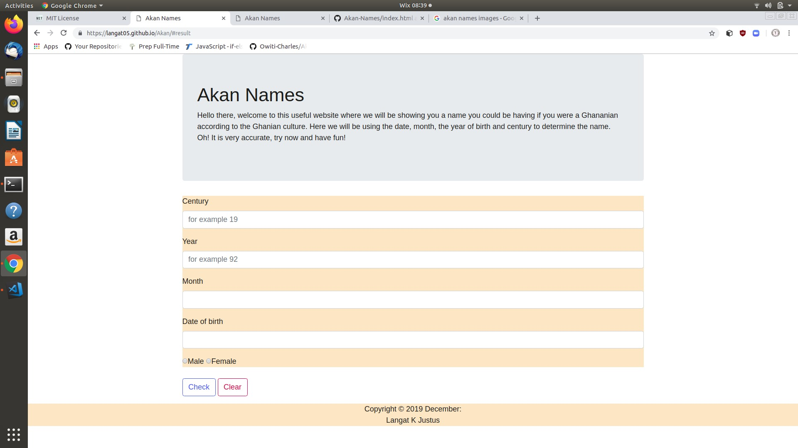

# AKAN NAMING SYSTEM
## Author
Langat K. Justus

## Description
- This is a website that gives you a name that you could be having if you were a Ghanian. It also gives you a day in which you were born depending on the gender.

## BDD
The website uses gender to determine the name you could be having according to the Ghanian culture. As a user, you have to input the century in which you were born e.g 20, then the year you were born e.g 95. From there, you also have to enter the month and date you were born and click submit. It will give you the day and the Akan name. The names given are based on the Ghanian culture.

## Navigation
- You can view the project by following this link https://langat05.github.io/Akan/
### To clone
- Ctrl + alt + t to open the terminal
- git clone https://langat05.github.io/Akan/
- cd Akan
- You can use code . or atom . to open it.

## Technologies Used
- HTML5
- CSS
- Bootstrap.css
- Javascript
## Screenshot overview
 

## LICENSE
- Licence under [MIT license](license)